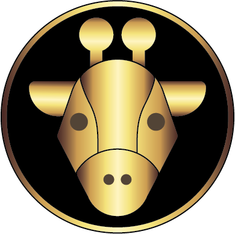

# AoC2021
My solutions for the Advent of Code 2021

### The Golden Giraffes

## Visualizations:

### Day 1

### Day 2

### Day 3

### Day 4

### Day 5

### Day 6

### Day 7

### Day 8

### Day 9

### Day 10

### Day 11

### Day 12

### Day 13

### Day 17

